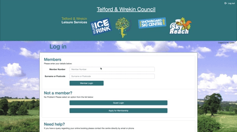
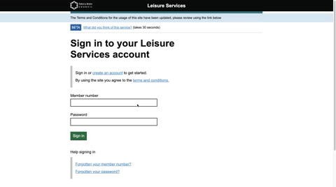

Telford Leisure Services (Frontend)
============

This is the front end for my redesign project of the [Telford Leisure Services sign up process](https://secureleisure.telford.gov.uk/lfbook.asp?wci=Login&=). This front end was built with Angular (v13) and designed using the [Gov Design Systems styles, components and patterns](https://design-system.service.gov.uk) to make it more consistent with GOV.UK.

---

## Demo

Here is a working live demo: https://telford-leisure-services-front.vercel.app/

---

## Design

Figma design file: https://www.figma.com/file/XnDJNj77ZnkZUftF5giXqe/telford-leisure-services 

^ The top row consists of screenshots of the current sign up process, and the bottom row my redesigns which I have implemented in this angular front end.

### Original Design



### GDS Redesign



---

## Key Features

* Ability for members to create new accounts using the 'Question Pages' GDS pattern
* Ability for members to change their answer to any question before account creation using the 'Check Answers' pattern
* Form validation with GDS error messages and summaries
* Ability to login to the service
* Ability to give feedback on the service
* Forgotten member number retrieval via email
* Password reset functionality

---

## How To Use

To clone and run this application, you'll need [Git](https://git-scm.com) and [Node.js](https://nodejs.org/en/download/) (which comes with [npm](http://npmjs.com)) installed on your computer. From your command line:

```bash
# Clone this repository
$ git clone https://github.com/chris-ian-jones/telford-leisure-services-front

# Go into the repository
$ cd telford-leisure-services-front

# Go into the Angular project folder
$ cd ng-telford-leisure-services

# Install dependencies
$ npm install

# Run the app
$ ng serve -o
```

> **Note**
> Here is a link to the backend project which you will also need running locally on your computer: https://github.com/chris-ian-jones/telford-leisure-services-back

---

## Built with 

- [Angular](https://angular.io/) - The modern web
developer's platform.
- [GOV.UK Design System](https://design-system.service.gov.uk/) - Design system to make your service consistent with GOV.UK. Learn from the research and experience of other service teams and avoid repeating work that’s already been done.
- [Sendinblue](https://www.sendinblue.com/) - Sendinblue’s API is used as an email router to send out emails

---

## License
>You can check out the full license [here](https://github.com/chris-ian-jones/telford-leisure-services-front/blob/main/LICENSE)

This project is licensed under the terms of the **MIT** license.
